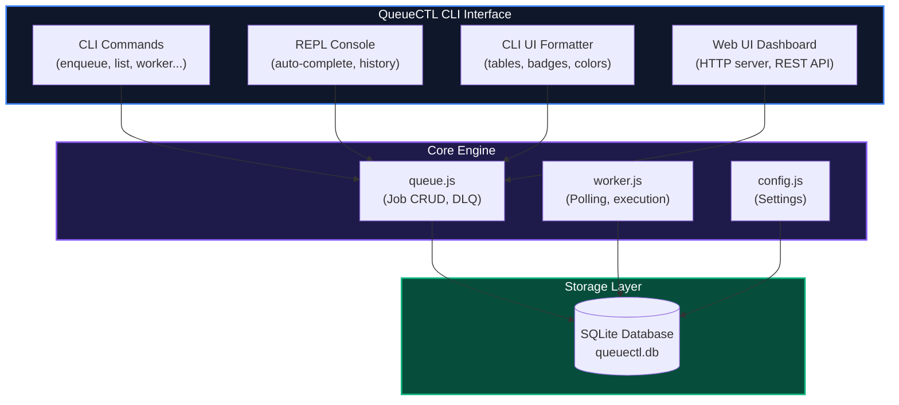
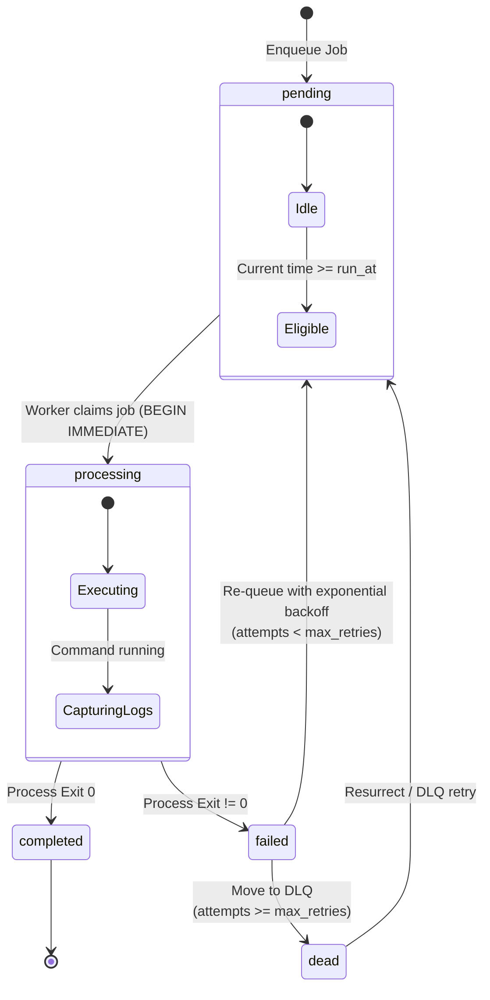
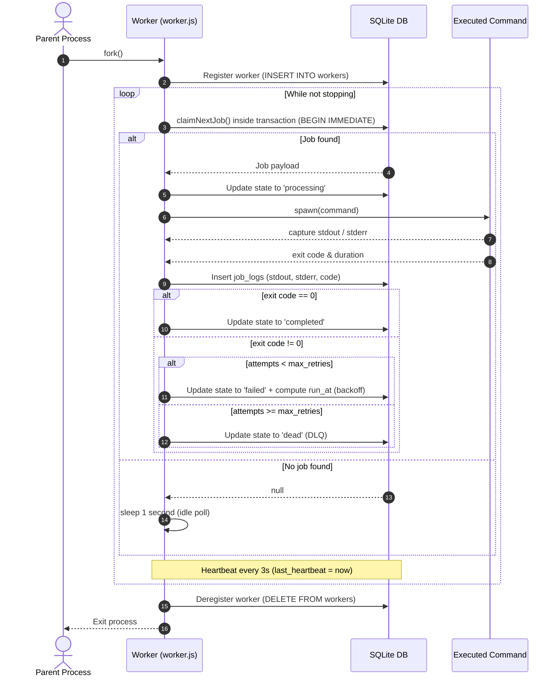
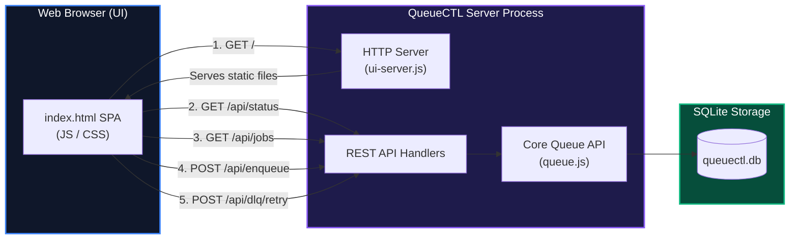

# QueueCTL — Architecture & Design

> A comprehensive technical document describing the internal architecture, design decisions, and system components of the QueueCTL background job queue engine.

---

## 1. System Overview

QueueCTL is a CLI-first, local background job queue engine that executes arbitrary shell commands with automatic retry, exponential backoff, priority scheduling, and dead letter queue (DLQ) semantics. All state is persisted in a local SQLite database, ensuring durability across process restarts.



---

## 2. Job Lifecycle State Machine

Jobs transition through five states. The state machine is enforced at the database level — workers atomically transition jobs using `BEGIN IMMEDIATE` transactions.



### State Definitions

| State | Description |
|---|---|
| `pending` | Job is waiting to be picked up by a worker. Includes newly enqueued jobs and retried DLQ jobs. |
| `processing` | A worker has claimed the job and is currently executing the command. |
| `completed` | Command exited with code 0. Job output (stdout) is stored. |
| `failed` | Command exited with non-zero code. A retry is scheduled using exponential backoff with a future `run_at` timestamp. |
| `dead` | All retry attempts exhausted. Job is moved to the Dead Letter Queue (DLQ) for manual investigation or resurrection. |

---

## 3. Concurrency & Locking Strategy

### The Problem
Multiple worker processes poll the same SQLite database for pending jobs. Without proper locking, two workers could claim the same job simultaneously, causing duplicate execution.

### The Solution: Atomic Job Claiming
We use SQLite's `BEGIN IMMEDIATE` transaction mode to serialize write access:

```javascript
// worker.js — claimNextJob()
const transaction = db.transaction(() => {
  const job = db.prepare(`
    SELECT * FROM jobs 
    WHERE (state = 'pending' OR state = 'failed')
      AND (run_at IS NULL OR run_at <= ?)
    ORDER BY priority DESC, created_at ASC
    LIMIT 1
  `).get(now);

  if (!job) return null;

  db.prepare(`
    UPDATE jobs SET state = 'processing', updated_at = ? WHERE id = ?
  `).run(now, job.id);

  return job;
});

return transaction.immediate();
```

**Why this works:**
1. `transaction.immediate()` acquires a **RESERVED lock** immediately — blocking other writers.
2. The `SELECT` and `UPDATE` happen atomically within the same transaction.
3. Any concurrent worker calling `transaction.immediate()` will block until the first transaction commits.
4. SQLite's `busy_timeout = 5000` prevents immediate `SQLITE_BUSY` errors — workers wait up to 5 seconds for the lock.

### WAL Mode
Write-Ahead Logging (WAL) is enabled at database initialization:
```javascript
db.pragma('journal_mode = WAL');
```
WAL allows concurrent **readers** (e.g., `status`, `list`, `metrics` commands) while a worker holds a write lock. Without WAL, any read would block during a write transaction.

---

## 4. Worker Engine Internals

### Worker Lifecycle



### Key Design Decisions

1. **Polling interval**: Workers poll every 1 second when idle (no pending jobs). This balances responsiveness with CPU usage.
2. **Heartbeat**: Every 3 seconds, workers update their `last_heartbeat` timestamp. The `status` command uses a 10-second threshold to determine if a worker is truly active.
3. **Graceful shutdown**: Workers check the database for a `status = 'stopping'` flag on every loop iteration. This allows `worker stop` to signal remote workers without needing direct IPC.

---

## 5. Exponential Backoff & Retry Logic

When a job fails but has remaining retries, a future `run_at` timestamp is computed:

```
delay = backoff_base ^ attempts  (in seconds)
```

| Attempt | Delay (base=2) | Delay (base=3) |
|---------|---------------|---------------|
| 1       | 2s            | 3s            |
| 2       | 4s            | 9s            |
| 3       | 8s            | 27s           |
| 4       | 16s           | 81s           |
| 5       | 32s           | 243s (~4min)  |

The `backoff-base` is configurable via `queuectl config set backoff-base <value>`.

After computing the delay, the job is updated:
```sql
UPDATE jobs SET state = 'failed', attempts = ?, run_at = ?, ... WHERE id = ?
```

Workers only claim jobs where `run_at IS NULL OR run_at <= now()`, so the job sits idle until the backoff period expires.

---

## 6. Data Persistence Model

### Database Schema

```sql
-- Core job storage
CREATE TABLE jobs (
  id          TEXT PRIMARY KEY,     -- User-defined unique identifier
  command     TEXT NOT NULL,        -- Shell command to execute
  state       TEXT DEFAULT 'pending', -- pending|processing|completed|failed|dead
  attempts    INTEGER DEFAULT 0,   -- Current attempt count
  max_retries INTEGER DEFAULT 3,   -- Maximum allowed retries
  priority    INTEGER DEFAULT 0,   -- Higher = executed first
  run_at      TEXT,                 -- ISO timestamp for delayed/retry scheduling
  timeout     INTEGER,             -- Execution timeout in seconds (NULL = unlimited)
  error_message TEXT,              -- Last error message
  output      TEXT,                -- Last stdout output
  started_at  TEXT,                -- When processing began
  duration_ms INTEGER,             -- Execution duration in milliseconds
  created_at  TEXT NOT NULL,       -- Job creation timestamp
  updated_at  TEXT NOT NULL        -- Last state change timestamp
);

-- Per-attempt execution logs
CREATE TABLE job_logs (
  id          INTEGER PRIMARY KEY AUTOINCREMENT,
  job_id      TEXT NOT NULL,       -- FK to jobs.id
  attempt     INTEGER NOT NULL,    -- Attempt number (1-indexed)
  stdout      TEXT,                -- Captured stdout
  stderr      TEXT,                -- Captured stderr
  exit_code   INTEGER,             -- Process exit code (0=success, -1=error)
  duration_ms INTEGER,             -- Attempt duration
  created_at  TEXT NOT NULL
);

-- Worker process registry
CREATE TABLE workers (
  pid             INTEGER PRIMARY KEY,  -- OS process ID
  status          TEXT NOT NULL,        -- active|stopping
  last_heartbeat  TEXT NOT NULL         -- ISO timestamp
);

-- Runtime configuration
CREATE TABLE config (
  key   TEXT PRIMARY KEY,          -- Config key name
  value TEXT NOT NULL              -- Config value
);
```

### Why SQLite?
- **Zero external dependencies**: No Redis, no PostgreSQL, no Docker. Just a single `.db` file.
- **ACID transactions**: Full data integrity guarantees for concurrent worker access.
- **WAL mode**: Enables concurrent reads during write transactions.
- **Durability**: Jobs survive process crashes, restarts, and system reboots.

---

## 7. Command Architecture

All CLI commands follow the same pattern:

```javascript
// commands/<name>.js
export function register(program) {
  program
    .command('<name>')
    .description('...')
    .option('--flag <value>', '...')
    .action(actionWrapper((options) => {
      // 1. Call core engine functions
      // 2. Format output with cli-ui functions
    }));
}
```

### Command Registry

| Command | Module | Core Function |
|---|---|---|
| `enqueue` | `commands/enqueue.js` | `queue.enqueue()` |
| `status` | `commands/status.js` | `queue.getStatus()` |
| `list` | `commands/list.js` | `queue.listJobs()` |
| `worker start/stop` | `commands/worker.js` | `worker.startWorker()` |
| `dlq list/retry` | `commands/dlq.js` | `queue.getDlq()`, `queue.retryDlq()` |
| `config list/set` | `commands/config.js` | `config.getAll()`, `config.set()` |
| `metrics` | `commands/metrics.js` | `queue.getMetrics()` |
| `logs <id>` | `commands/logs.js` | `queue.getJobLogs()` |
| `ui` | `commands/ui.js` | `startUiServer()` |

### Error Handling
All command actions are wrapped in `actionWrapper()`, which catches errors and displays them using the styled `error()` formatter instead of crashing with raw stack traces.

---

## 8. Web UI Architecture

The Web UI is an embedded HTTP server that serves a single-page HTML dashboard with a REST API backend.



### API Endpoints

| Method | Path | Description |
|---|---|---|
| `GET` | `/` | Serve `index.html` dashboard |
| `GET` | `/api/status` | Job state counts + active workers |
| `GET` | `/api/jobs` | All jobs with full details |
| `GET` | `/api/metrics` | Execution statistics |
| `GET` | `/api/logs?id=<jobId>` | Per-attempt logs for a job |
| `POST` | `/api/enqueue` | Create a new job (JSON body) |
| `POST` | `/api/dlq/retry` | Resurrect a DLQ job (JSON body) |

---

## 9. Directory Structure

```
queuectl/
├── bin/
│   └── queuectl.js           # CLI entry point (shebang, Commander setup)
├── src/
│   ├── commands/              # CLI command definitions
│   │   ├── config.js          # config list/set
│   │   ├── dlq.js             # dlq list/retry
│   │   ├── enqueue.js         # enqueue (JSON or flags)
│   │   ├── list.js            # list [--state]
│   │   ├── logs.js            # logs <jobId>
│   │   ├── metrics.js         # metrics
│   │   ├── status.js          # status dashboard
│   │   ├── ui.js              # web ui server
│   │   └── worker.js          # worker start/stop
│   ├── core/                  # Business logic (no CLI/UI dependencies)
│   │   ├── config.js          # Configuration CRUD
│   │   ├── queue.js           # Job CRUD, metrics, DLQ operations
│   │   └── worker.js          # Worker engine (polling, execution, retry)
│   ├── db/
│   │   └── connection.js      # SQLite connection + schema migrations
│   ├── cli-ui/
│   │   └── format.js          # Terminal formatting (colors, tables, badges)
│   ├── public/
│   │   └── index.html         # Web UI dashboard (single-file SPA)
│   ├── repl.js                # Interactive REPL session
│   └── ui-server.js           # Embedded HTTP server + REST API
├── tests/
│   ├── enqueue.test.js        # Validation & persistence
│   ├── retry-backoff.test.js  # Exponential backoff timing
│   ├── dlq.test.js            # DLQ transition & resurrection
│   ├── concurrency.test.js    # Multi-worker no-overlap
│   └── restart-persistence.test.js # Cross-restart durability
├── architecture.md            # This file
├── package.json
├── queuectl.db                # SQLite database (auto-created)
└── README.md
```

---

## 10. Design Trade-offs

| Decision | Trade-off | Rationale |
|---|---|---|
| SQLite over Redis | No pub/sub, no distributed queues | Zero external dependencies; ACID durability; single-binary deployment |
| `child_process.fork()` over `worker_threads` | Higher memory per worker | Process-level isolation prevents a crashed command from taking down the engine |
| Polling (1s interval) over event-driven | Slight latency on job pickup | Simpler implementation; no need for file watchers or IPC channels; robust against edge cases |
| Shell execution via `spawn` | Security risk with arbitrary commands | Acceptable for a local development tool; production use should sandbox via Docker |
| Single SQLite file | No horizontal scaling | Appropriate for the scope of a CLI tool; scales to thousands of jobs on a single machine |
